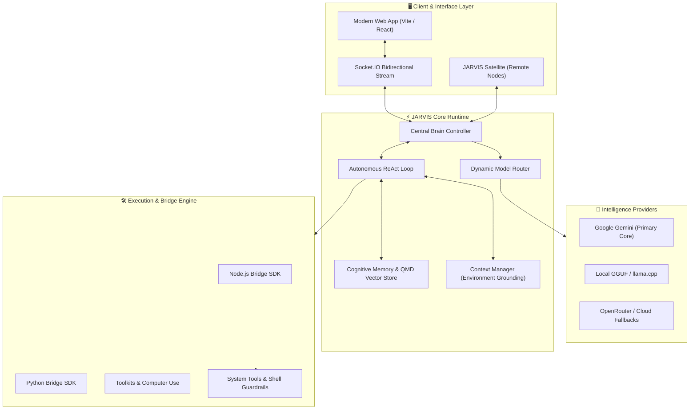

<div align="center">

# ⚡ J.A.R.V.I.S.
### *Just A Rather Very Intelligent System*
**Next-Generation Autonomous Personal AI Assistant & Agent Framework**

[](https://github.com/janveryuu)
[](LICENSE.md)
[](https://nodejs.org/)
[](https://pnpm.io/)
[](https://python.org/)
[](https://ai.google.dev/)

<p align="center">
  <a href="#-features">Features</a> •
  <a href="#-architecture">Architecture</a> •
  <a href="#-quick-start">Quick Start</a> •
  <a href="#-configuration">Configuration</a> •
  <a href="#-operating-modes">Operating Modes</a> •
  <a href="#-project-structure">Project Structure</a> •
  <a href="#-author">Author</a>
</p>

---

</div>

## 🌌 Overview

**JARVIS** is an advanced, privacy-first, fully autonomous personal AI assistant engineered for deep reasoning, computer use, environment awareness, and grounded task execution.

Unlike traditional text-only chatbots, JARVIS acts as an active agent in your workflow: planning multi-step objectives, inspecting your local environment, manipulating desktop applications, automating browser sessions, and retaining long-term memories across conversations.

---

## 🚀 Key Highlights & Capabilities

### 🧠 Google Gemini Powered Core
- Engineered to utilize **Google Gemini** as the primary intelligence engine.
- Leverages Gemini's ultra-low latency, massive context window, native multimodal perception (vision & audio), and high-fidelity tool-calling capabilities.
- Seamless fallback and multi-model routing for local llama.cpp GGUF inference when working offline.

### 🔄 Continuous Autonomous Agent Loop
- Operates on a continuous tool-calling transcript: **Plan ➔ Act ➔ Observe ➔ Self-Correct ➔ Complete**.
- Progressive toolkit loading: dynamically brings in function schemas only when needed to maintain optimal token efficiency.
- Deterministic runtime safety guards, argument repair, and loop-prevention heuristics.

### 🖥️ Computer Use & Automation
- **Desktop Application Control**: Cross-platform window management, GUI inspection, click/keyboard automation, and verified visual execution.
- **Browser Automation**: Dedicated headless or visual browser controller for research, web scraping, form submission, and live testing.
- **Satellite Architecture**: Connect remote devices to run tool actions locally on physical hardware while preserving a centralized brain.

### 🧬 Cognitive Layered Memory
- **Discussion Memory**: Working scratchpad and recent conversational context.
- **Daily Memory**: Journaled timelines and periodic summaries of day-to-day actions.
- **Persistent Memory**: Durable knowledge base, personal preferences, and core owner profile (`OWNER.md`).
- **Semantic Retrieval**: QMD-indexed embeddings with hybrid BM25 and vector search for instant contextual recall.

### 🔌 Polyglot Skill & Tool Ecosystem
- Native skills and tools built with **Node.js** and **Python** bridges.
- Agent skills defined via lightweight, markdown-based `SKILL.md` directives.
- Clean layer separation: `Skills ➔ Actions ➔ Tools ➔ Functions ➔ Binaries`.

### 🌐 Modern Reactive Interface
- Real-time **Socket.IO** bidirectional dialogue interface.
- Modern Web App dashboard with dark-mode aesthetic, live telemetry, and generated artifact previews.
- Fully isolated multi-profile runtime.

---

## 🏛️ System Architecture



---

## ⚡ Quick Start

### 1. Prerequisites

Ensure your system has the following installed:
- **Node.js**: `>= 24.0.0`
- **pnpm**: `>= 11.0.0` (managed via `pnpm add -g pnpm`)
- **Python**: `>= 3.11.0`
- Supported OS: Windows 10/11, macOS, Linux

### 2. Clone the Repository

```bash
git clone https://github.com/janveryuu/JARVIS..git
cd JARVIS.
```

### 3. Install Dependencies & Setup Environment

```bash
pnpm install
```

> The automated installer configures Leon/JARVIS core runtime paths (`~/.leon/profiles/just-me/`), provisions managed Python/uv environments, trains initial skills, and builds the production server and web client.

### 4. Configure Your AI Provider (Google Gemini)

1. Open your profile secret file located at:
   `~/.leon/profiles/just-me/.env`

2. Add your **Google Gemini API Key**:
   ```env
   LEON_PROFILE_TOKEN=<auto-generated-token>
   GEMINI_API_KEY=your_gemini_api_key_here
   ```

3. Open your profile configuration file at:
   `~/.leon/profiles/just-me/config.yml`

4. Set Gemini as your primary model:
   ```yaml
   routing:
     mode: agent

   llm:
     default: google/gemini-2.5-flash
     agent: google/gemini-2.5-flash
     workflow: google/gemini-2.5-flash
   ```

### 5. Launch JARVIS

#### Standard / Production Mode:
```bash
pnpm start
```
*Access the interface at **`http://localhost:5366`***.

#### Development Mode (Hot-Reloading):
```bash
# Terminal 1: Backend Server
pnpm run dev:server

# Terminal 2: Web App
pnpm run dev:web-app
```
*Access the developer interface at **`http://localhost:5173`***.

---

## ⚙️ Operating Modes

JARVIS can adapt its operational style dynamically or per command:

| Mode | Trigger | Description |
| :--- | :--- | :--- |
| **`agent`** (Default) | `routing.mode: agent` | Continuous autonomous reasoning, planning, multi-tool executions, and verification loop. |
| **`smart`** | `routing.mode: smart` | Auto-detects the optimal path: executes instant native actions for simple queries or switches to agent mode for complex requests. |
| **`controlled`** | `routing.mode: controlled` | Strict deterministic routing following defined skills and predefined action flows without free-form LLM deviations. |

---

## 📂 Project Structure

```
JARVIS/
├── app/                  # Built-in lightweight web client
├── web-app/              # Next-gen React web interface (TanStack Router & Query)
├── aurora/               # UI design system & preview components
├── server/               # Core backend: routing, agent loop, memory, HTTP/Socket.IO
│   ├── src/core/         # Brain, prompt generation, LLM duties & routing
│   ├── src/helpers/      # System, network, and runtime helpers
│   └── src/satellite.ts  # Remote device worker entrypoint
├── skills/               # Capabilities ecosystem
│   ├── native/           # Fast deterministic skills (Node.js & Python)
│   └── agent/            # High-level skills guided by SKILL.md specs
├── bridges/              # Cross-runtime execution bridges
│   ├── nodejs/           # Node.js SDK and runtime harness
│   └── python/           # Python SDK and virtualenv manager
├── tcp_server/           # Background Python services (Voice & DSP)
├── tools/                # Device, computer use, browser, and system toolkits
└── bin/                  # CLI launcher and portable binaries
```

---

## 🛡️ License

This project is licensed under the **MIT License** — see the [LICENSE.md](LICENSE.md) file for details.

---

<div align="center">

### Built with Passion by [janveryuu](https://github.com/janveryuu)
*Empowering individuals with real autonomous intelligence.*

</div>
